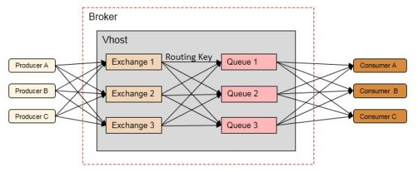

## 1、RabbitMQ简单介绍:

RabbitMQ是一个开源的消息代理和队列服务器，用来通过普通协议在完全不同的应用之间传递数据，RabbitMQ是使用Erlang语言来编写的，并且RabbitMQ是基于AMQP协议的。
推介一篇文章：[SpringBoot+RabbitMQ ，保证消息100%投递成功并被消费（附源码）](https://mp.weixin.qq.com/s/AgZiiDpkVyGod_nB8DrUvw)

### 1.1、特点：
1. RabbitMQ底层使用Erlang语言编写，传递效率高，延迟低
2. 开源、性能优秀、稳定性较高
3. 与SpringAMQP完美的整合、API丰富
4. 集群模式丰富、表达式配置、HA模式、镜像队列模式
5. 保证数据不丢失的情况下，做到高可用
6. AMQP全称：Advanced Message Queuing Protocol
7. AMQP翻译:高级消息队列协议

### 1.2、 AMQP核心概念
- Server：又称Broker，接收客户端的连接，实现AMQP实体服务

- Connection：连接，应用程序与Broker的网络连接

- Channel：网络信道，几乎所有的操作都在Channel中进行，包括定义Queue、定义Exchange、绑定Queue与Exchange、发布消息等。Channel是进行消息读写的通道。客户端可以建立多个Channel，每个Channel代表一个会话任务。

- Message：消息，服务器和应用程序之间传送的数据，由Properties和Body组成。Properties可以对消息进行修饰，比如消息的优先级、延迟等高级特性；Body就是消息体内容。

- Virtual host：虚拟地址，用于进行逻辑隔离，最上层的消息路由。一个Virtual host可以有若干个Exchange和Queue，同一个Virtual host里面不能有相同的Exchange和Queue

- Exchange：交换机，接收消息，根据路由键转发消息到绑定的队列

  RabbitMQ中有三种常用的交换机类型

  - direct: 如果路由键匹配，消息就投递到对应的队列
  - fanout：投递消息给所有绑定在当前交换机上面的队列
  - topic：允许实现有趣的消息通信场景，使得5不同源头的消息能够达到同一个队列。topic队列名称有两个特殊的关键字。

- Binding：Exchange和Queue之间的虚拟连接，binding中可以包含routing key

- Routing key：一个路由规则，虚拟机可用它来确定如何路由一个特定消息

- Queue：也称为Message Queue，消息队列，保存消息并将它们转发给消费者，多个消费者可以订阅同一个Queue，这时Queue中的消息会被平均分摊给多个消费者进行处理，而不是每个消费者都收到所有的消息并处理。

- Prefetch count：如果有多个消费者同时订阅同一个Queue中的消息，Queue中的消息会被平摊给多个消费者。这时如果每个消息的处理时间不同，就有可能会导致某些消费者一直在忙，而另外一些消费者很快就处理完手头工作并一直空闲的情况。我们可以通过设置prefetchCount来限制Queue每次发送给每个消费者的消息数，比如我们设置prefetchCount=1，则Queue每次给每个消费者发送一条消息；消费者处理完这条消息后Queue会再给该消费者发送一条消息。

### 1.3、消息流转流程图


## 2、RabbitMQ整合SpringBoot2.x,消息可靠性传递方案100%的实现
### 2.1、方案流程图

### 2.2、 代码实现

1. 引入相关依赖
```
<dependency>
    <groupId>org.springframework.boot</groupId>
    <artifactId>spring-boot-starter-amqp</artifactId>
</dependency>
```
2. 配置application.yml
```
## producer配置
spring:
  rabbitmq:
    addresses: 192.168.221.128:5672
    username: guest
    password: guest
    virtual-host: /
  datasource:
    url: jdbc:mysql://localhost:3306/rabbitmq?useUnicode=true&characterEncoding=utf-8&zeroDateTimeBehavior=convertToNull
    username: root
    password: root
    driverClassName: com.mysql.jdbc.Driver
server:
  port: 8001
  servlet:
    context-path: /
```

```
## consumer配置
## springboot整合rabbitmq的基本配置
spring:
  rabbitmq:
    addresses: 192.168.221.128:5672
    username: guest
    password: guest
    virtual-host: /
## 消费端配置
    listener:
      simple:
        concurrency: 5
        acknowledge-mode: manual
        max-concurrency: 10
        prefetch: 1
  datasource:
      url: jdbc:mysql://localhost:3306/rabbitmq?useUnicode=true&characterEncoding=utf-8&zeroDateTimeBehavior=convertToNull
      username: root
      password: root
      driverClassName: com.mysql.jdbc.Driver
server:
  port: 8002
  servlet:
    context-path: /
```
### 2.3、演示步骤:

1. 修改配置文件中的rabbitmq配置和数据库配置

2. run ConsumerApplication 来开启消费者服务

3. run ProducerApplication 来开启生产者服务

4. run SpringbootProducerApplicationTests 中的testSend方法来发送消息进行测试

### 2.4、数据库文件
```sql
-- ----------------------------
-- Table structure for broker_message_log
-- ----------------------------
DROP TABLE IF EXISTS `broker_message_log`;
CREATE TABLE `broker_message_log` (
  `message_id` varchar(255) NOT NULL COMMENT '消息唯一ID',
  `message` varchar(4000) NOT NULL COMMENT '消息内容',
  `try_count` int(4) DEFAULT '0' COMMENT '重试次数',
  `status` varchar(10) DEFAULT '' COMMENT '消息投递状态 0投递中，1投递成功，2投递失败',
  `next_retry` timestamp NOT NULL DEFAULT '0000-00-00 00:00:00' ON UPDATE CURRENT_TIMESTAMP COMMENT '下一次重试时间',
  `create_time` timestamp NOT NULL DEFAULT '0000-00-00 00:00:00' ON UPDATE CURRENT_TIMESTAMP,
  `update_time` timestamp NOT NULL DEFAULT '0000-00-00 00:00:00' ON UPDATE CURRENT_TIMESTAMP,
  PRIMARY KEY (`message_id`)
) ENGINE=InnoDB DEFAULT CHARSET=utf8;

-- ----------------------------
-- Table structure for t_order
-- ----------------------------
DROP TABLE IF EXISTS `t_order`;
CREATE TABLE `t_order` (
  `id` int(11) NOT NULL AUTO_INCREMENT,
  `name` varchar(255) DEFAULT NULL,
  `message_id` varchar(255) DEFAULT NULL,
  PRIMARY KEY (`id`)
) ENGINE=InnoDB AUTO_INCREMENT=2018091102 DEFAULT CHARSET=utf8;
```

> 代码实例及学习参考内容来自慕课网课程[RabbitMQ消息中间件极速入门与实战](https://www.imooc.com/learn/1042)

## 3、学习记录
1. [RabbitMQ安装与配置](https://github.com/suxiongwei/suxiongwei.github.io/blob/master/article/other/rabbitmq_install.md)
2. [RabbitMQ：消息发送确认与消息接收确认（ACK）](https://www.jianshu.com/p/2c5eebfd0e95)
3. [消息中间件选型分析——从Kafka与RabbitMQ的对比来看全局](http://blog.didispace.com/%E6%B6%88%E6%81%AF%E4%B8%AD%E9%97%B4%E4%BB%B6%E9%80%89%E5%9E%8B%E5%88%86%E6%9E%90/)
4. [RabbitMQ必备核心知识](http://www.imooc.com/article/75201)
5. [Spring Boot 实现 RabbitMQ 延迟消费和延迟重试队列](https://www.cnblogs.com/xishuai/p/spring-boot-rabbitmq-delay-queue.html)
6. [IM系统的MQ消息中间件选型：Kafka还是RabbitMQ？](https://zhuanlan.zhihu.com/p/37993013)
7. [(转载)如何保证消息队列的高可用？](https://github.com/doocs/advanced-java/blob/master/docs/high-concurrency/how-to-ensure-high-availability-of-message-queues.md)
8. [(转载)为什么使用消息队列？消息队列有什么优点和缺点？Kafka、ActiveMQ、RabbitMQ、RocketMQ 都有什么优点和缺点？](https://github.com/doocs/advanced-java/blob/master/docs/high-concurrency/why-mq.md)
9. [(转载)如何保证消息的可靠性传输？（如何处理消息丢失的问题）](https://github.com/doocs/advanced-java/blob/master/docs/high-concurrency/how-to-ensure-the-reliable-transmission-of-messages.md)

## 4、其它
### 4.1、RPC和MQ各自适合的应用场景
- RPC比较适合- 客户端调用哪个服务器比较明确调用需要立即得到返回结果 
  架构简单 在一个由多个微服务构成的大系统中，某些关键服务间的调用应当在较短的时间内返回，而且各个微服务的专业化程度较高，同一个请求的关注者只有一个。这个时候就应该用RPC。 比如在一个ERP系统中，有一个管理仓储的微服务，以及一个负责订单的微服务。新建订单时需要查知当前的存货是否充足，如果不充足就通知用户；提交订单时预订指定数量的货物，如果此时货物不错，也要终止订单的提交，并通知用户。显然在这种场景下是不允许较大的延迟，否则会影响用户体验。所以应该使用RPC，及时返回仓储情况。 

- MQ比较适合消息的发送者和消费者需要解耦的情况发送者并不明确谁是消费者发送者并不关心谁来消费消息 
  各个消费者可以从不同的角度入手处理消息消费者的处理结果也不返回给发送者消息的发送和处理是异步的
  消息的关注者不止一个 在一个由多个微服务构成的大系统中，会有一些非关键服务，用来执行一些不需要立刻得到结果的计算。而且它们的计算结果并不会返回给消息的发送者。这个时候就应该使用MQ。


